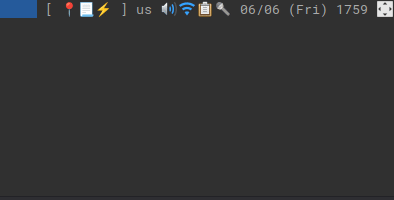

# 🎤 `mic-icon`



It's [`volumeicon`](https://github.com/Maato/volumeicon) for microphones! but, it sucks and it's written in an inferior language 😅. Only works on Linux (sorry, I'm honestly incompetent with other OSs).

In this modern internet dystopia, I often share my screen and disable notifications when presenting. This means that I don't get to see my "Microphone is [STATE]" notifications when sharing (I do tend to mute a fair bit for coughs). Imagine muting and forgetting to unmute as you continue to speak… OOOOH!!! THE MODERN SHAME!! 😭. 

With that spiel said, I just needed something that aims to be a "lightweight mic status indicator that sits in your systray" and here it is… TADA! just like `volumeicon` it's `mic-icon`!

I really just wrote this for myself and sharing it on the internet 🤷‍♂️.

## Dependencies

* Python 3
    * this thing is so simple I'll be surprised if we're facing any version incompatibilities already
* `pulsectl`
* `pygobject`
* `pactl` command (part of the `pulseAudio` or `pipewire-pulse` packages)
* GTK 3.0 (via your system package manager)
* AppIndicator3 (via your system package manager)

## Installation

virtualenv is the way!

```sh
python -m venv .venv
```

then activate the `venv`…

```sh
source .venv/bin/activate
```

(if you're a fish user, it would be  `source .venv/bin/activate.fish` 😉)

then…

```sh
pip install . 
```

then…

```sh
mic-icon
```

and now you have it! symlink that `./.venv/bin/mic-icon` sumbitch somewhere in your `PATH=` and run it on start-up — or however, the heck you want.


